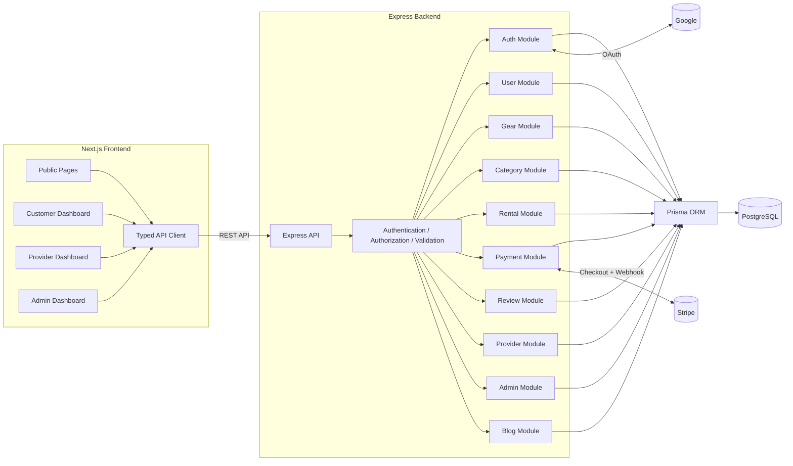
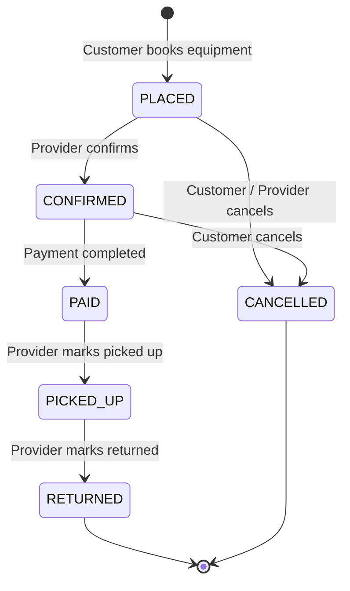
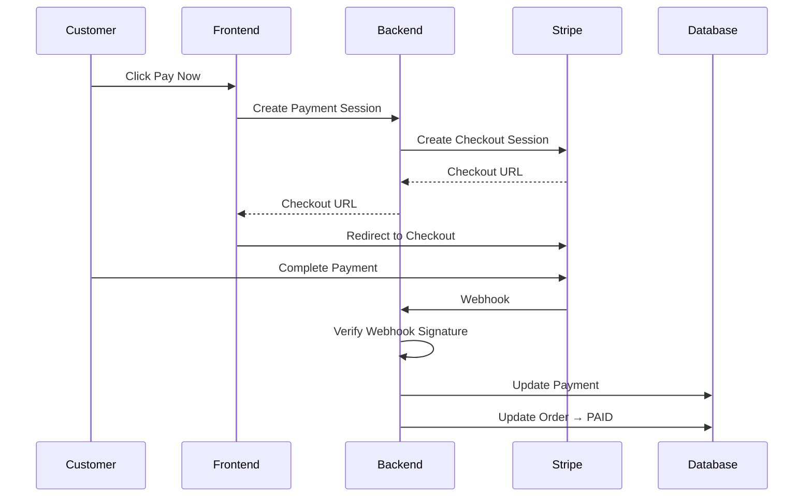
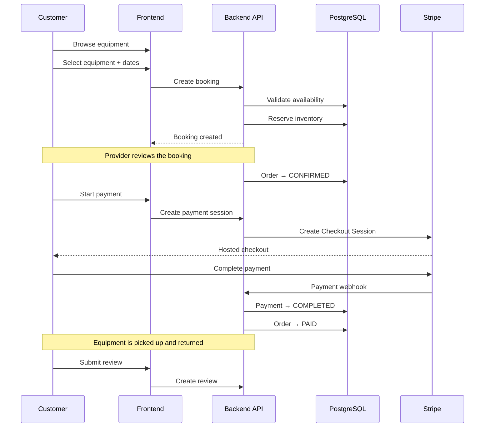
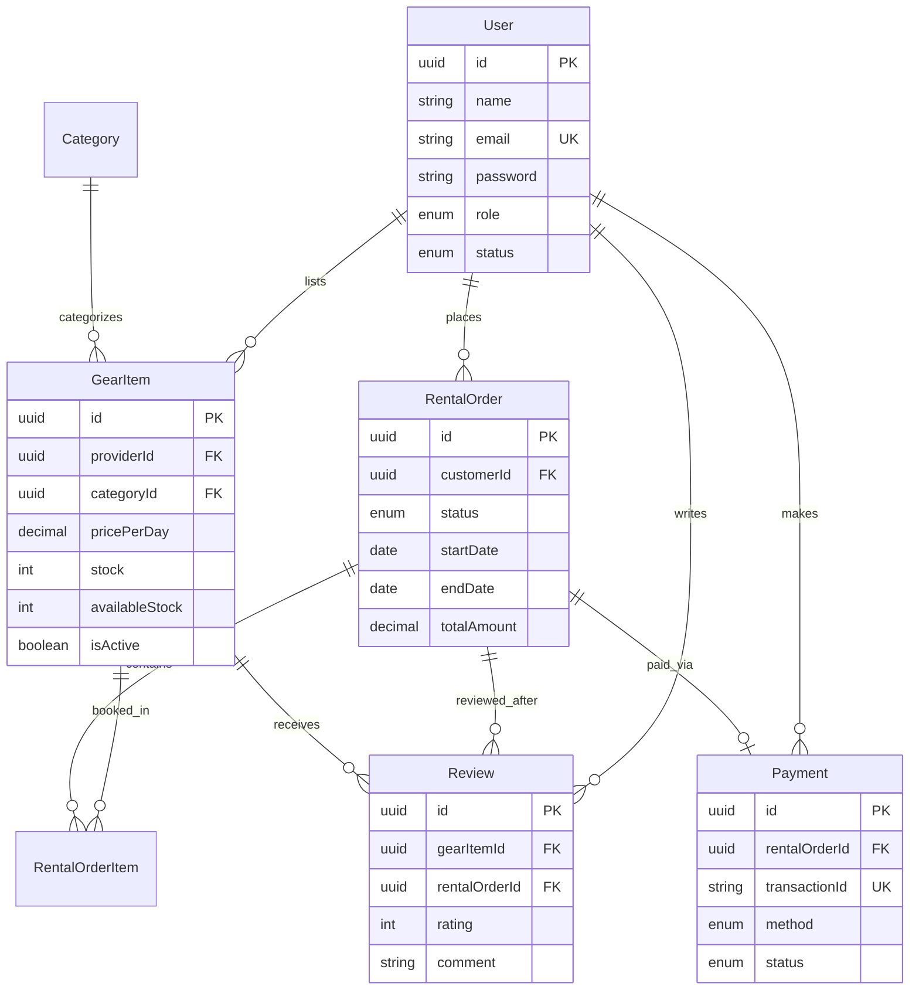

<div align="center">

# 🏕️ LensLoop

### Outdoor Equipment Booking Platform

A full-stack platform for discovering, booking, and managing outdoor equipment — connecting customers with local equipment providers through a secure, role-based platform.

[](https://www.typescriptlang.org/)
[](https://nextjs.org/)
[](https://expressjs.com/)
[](https://www.postgresql.org/)
[](https://www.prisma.io/)
[](https://tailwindcss.com/)
[](https://stripe.com/)

**Live Demo** · **API Reference** · **Documentation**

</div>

---

## 📖 Overview

**LensLoop** is a full-stack outdoor equipment booking platform designed to connect customers with local equipment providers.

Customers can discover outdoor and adventure equipment, check availability, select booking dates, place orders, complete secure payments, and track their orders through a structured workflow.

Providers receive a dedicated workspace to manage equipment, inventory, pricing, and incoming orders, while administrators control platform-wide users, listings, categories, analytics, moderation, and blog content.

The project was built as a production-style marketplace application rather than a simple CRUD project, with emphasis on:

* Secure authentication and authorization
* Role-based multi-tenant architecture
* Date-based availability
* Atomic inventory management
* Server-enforced order transitions
* Stripe payment integration
* Provider operations
* Administrative analytics
* Content/blog management
* Automatic access-token refresh
* Responsive light/dark UI

---

## ✨ Key Features

### 🌍 Public Platform

* Responsive outdoor equipment catalog
* Equipment detail pages
* Image galleries and specifications
* Provider information
* Search and filtering
* Category-based browsing
* Price-based filtering
* Availability-aware equipment discovery
* Sorting and pagination
* Related equipment discovery

### 👤 Customer

* Email/password authentication
* Google Login
* Demo Login
* JWT-based sessions
* Automatic access-token refresh
* Browse and search equipment
* Select booking dates
* Real-time availability validation
* Date-based pricing
* Create equipment bookings
* Track order status
* Cancel eligible orders
* Secure Stripe checkout
* Payment history
* Review system after completed bookings
* Profile management

### 🏪 Provider

* Dedicated provider dashboard
* Revenue analytics
* Inventory analytics
* Equipment CRUD
* Multiple equipment images
* Pricing management
* Stock management
* Equipment specifications
* Incoming booking management
* Order status updates
* Automatic stock restoration when applicable
* Provider profile management

### 🛡️ Admin

* Platform-wide analytics dashboard
* Revenue statistics
* Order-status analytics
* User composition analytics
* User management
* User suspension/activation
* Equipment moderation
* Listing visibility controls
* Category management
* Complete order oversight
* Blog post management
* Create, update, publish, and manage blog content

---

## 🔐 Authentication

LensLoop implements a secure authentication system supporting multiple login methods.

### Email & Password

* Registration
* Login
* Password hashing with bcrypt
* JWT access token
* JWT refresh token
* Automatic access-token renewal
* Logout
* Protected API routes

### Google Authentication

Users can authenticate using their Google account through Google OAuth integration.

### Demo Login

The application also includes predefined demo accounts for quickly testing different role-based experiences:

| Role     | Purpose                                         |
| -------- | ----------------------------------------------- |
| Customer | Test customer booking workflow                  |
| Provider | Test equipment and order management             |
| Admin    | Test moderation, analytics, and blog management |

---

## 🧑‍💻 Role-Based Architecture

LensLoop uses a three-role authorization model:

```text
                    ┌──────────────────┐
                    │     LensLoop     │
                    └────────┬─────────┘
                             │
          ┌──────────────────┼──────────────────┐
          │                  │                  │
          ▼                  ▼                  ▼
     👤 Customer        🏪 Provider         🛡️ Admin
          │                  │                  │
          ▼                  ▼                  ▼
      Book Gear         Manage Gear        Manage Platform
      Track Orders      Manage Orders      Manage Users
      Payments          Analytics          Analytics
      Reviews           Inventory          Moderation
                                         Blog Management
```

Authorization is enforced on the server rather than relying only on frontend route protection.

---

## 🧱 Tech Stack

| Layer              | Technology                              |
| ------------------ | --------------------------------------- |
| **Frontend**       | Next.js, TypeScript                     |
| **UI**             | Tailwind CSS, shadcn/ui, Radix UI       |
| **Forms**          | React Hook Form                         |
| **Validation**     | Zod                                     |
| **Charts**         | Recharts                                |
| **Backend**        | Node.js, Express.js, TypeScript         |
| **Database**       | PostgreSQL                              |
| **ORM**            | Prisma                                  |
| **Authentication** | JWT, bcrypt                             |
| **OAuth**          | Google OAuth                            |
| **Payments**       | Stripe Checkout + Webhooks              |
| **HTTP Client**    | Custom typed API client                 |
| **Icons**          | Lucide React                            |
| **Notifications**  | Sonner                                  |
| **Deployment**     | Vercel / Render-compatible architecture |

---

## 🏗️ System Architecture



---

## 🔄 Booking & Order Lifecycle

LensLoop uses a server-enforced order state machine to ensure that customers and providers cannot arbitrarily skip business-critical steps.



Every transition is validated on the backend through an explicit transition policy.

For example:

```text
PLACED → PICKED_UP
```

is rejected because the order must first be confirmed and paid.

This prevents clients from bypassing important business rules by manually modifying request payloads.

---

## ⚡ Concurrent Inventory Protection

One of the core challenges of LensLoop is preventing multiple customers from successfully booking the same limited equipment simultaneously.

The backend uses database transactions to:

1. Validate requested availability
2. Check current stock
3. Create the booking order
4. Update inventory
5. Commit the transaction atomically

This protects the system against overselling when multiple customers attempt to book the same equipment concurrently.

---

## 💳 Payment Architecture

LensLoop uses **Stripe Checkout** for secure payment processing.



Payment confirmation is handled through the Stripe webhook rather than trusting only the client-side redirect.

---

## 🗺️ User Journey



---

## 🗄️ Data Model



---

## ✍️ Admin Blog Management

LensLoop includes a dedicated content-management capability for administrators.

Admins can manage platform blog content without requiring database-level changes.

### Blog capabilities

* Create blog posts
* Edit existing posts
* Publish posts
* Update published content
* Manage blog metadata
* Delete posts
* Public blog listing
* Individual blog post pages

This allows LensLoop to function not only as an equipment booking platform but also as a content-driven outdoor community platform.

---

## 📁 Project Structure

### Backend

```text
gearup-backend/
│
├── src/
│   ├── app.ts
│   ├── server.ts
│   │
│   ├── config/
│   │   ├── env.ts
│   │   ├── prisma.ts
│   │   └── stripe.ts
│   │
│   ├── middleware/
│   │   ├── auth.middleware.ts
│   │   ├── role.middleware.ts
│   │   ├── validate.middleware.ts
│   │   └── error.middleware.ts
│   │
│   ├── routes/
│   │   └── index.ts
│   │
│   └── modules/
│       ├── auth/
│       ├── user/
│       ├── gear/
│       ├── category/
│       ├── provider/
│       ├── rental/
│       ├── payment/
│       ├── review/
│       ├── admin/
│       ├── blog/
│       └── upload/
│
└── prisma/
    ├── schema.prisma
    └── seed.ts
```

### Frontend

```text
gearup-frontend/
│
├── app/
│   ├── layout.tsx
│   ├── page.tsx
│   │
│   ├── gear/
│   │   └── [id]/
│   │
│   ├── login/
│   ├── register/
│   │
│   ├── payment/
│   │   ├── success/
│   │   └── cancel/
│   │
│   └── dashboard/
│       ├── customer/
│       ├── provider/
│       └── admin/
│
├── components/
│   ├── ui/
│   ├── layout/
│   ├── landing/
│   ├── gear/
│   └── dashboard/
│
├── lib/
│   ├── api.ts
│   ├── auth-context.tsx
│   ├── validations.ts
│   └── types.ts
│
└── middleware.ts
```

---

# 🔌 API Reference

All endpoints are prefixed with:

```text
/api
```

Protected endpoints require an authenticated session.

---

## Authentication & Users

| Method | Endpoint             | Access    | Description                  |
| ------ | -------------------- | --------- | ---------------------------- |
| POST   | `/auth/register`     | Public    | Register a customer/provider |
| POST   | `/auth/login`        | Public    | Login with email/password    |
| POST   | `/auth/google`       | Public    | Authenticate using Google    |
| POST   | `/auth/refresh`      | Public    | Refresh access token         |
| GET    | `/auth/me`           | Protected | Get current user             |
| POST   | `/auth/logout`       | Protected | Logout current session       |
| PUT    | `/users/me`          | Protected | Update profile               |
| PUT    | `/users/me/password` | Protected | Change password              |

---

## Gear & Categories

| Method | Endpoint          | Access | Description           |
| ------ | ----------------- | ------ | --------------------- |
| GET    | `/gear`           | Public | Browse equipment      |
| GET    | `/gear/:id`       | Public | Get equipment details |
| GET    | `/categories`     | Public | Get categories        |
| POST   | `/categories`     | Admin  | Create category       |
| PUT    | `/categories/:id` | Admin  | Update category       |
| DELETE | `/categories/:id` | Admin  | Delete category       |

---

## Bookings & Payments

| Method | Endpoint                   | Access    | Description             |
| ------ | -------------------------- | --------- | ----------------------- |
| POST   | `/rentals`                 | Customer  | Create booking          |
| GET    | `/rentals`                 | Customer  | Get customer's bookings |
| GET    | `/rentals/:id`             | Customer  | Get booking details     |
| PATCH  | `/rentals/:id/cancel`      | Customer  | Cancel booking          |
| POST   | `/payments/create`         | Customer  | Create Stripe checkout  |
| POST   | `/payments/confirm`        | Protected | Confirm payment         |
| POST   | `/payments/webhook/stripe` | Stripe    | Process Stripe webhook  |
| GET    | `/payments`                | Protected | Payment history         |
| GET    | `/payments/:id`            | Protected | Payment details         |

---

## Provider Operations

| Method | Endpoint               | Access   | Description           |
| ------ | ---------------------- | -------- | --------------------- |
| GET    | `/provider/dashboard`  | Provider | Provider analytics    |
| POST   | `/provider/gear`       | Provider | Create equipment      |
| GET    | `/provider/gear`       | Provider | Provider equipment    |
| PUT    | `/provider/gear/:id`   | Provider | Update equipment      |
| DELETE | `/provider/gear/:id`   | Provider | Delete equipment      |
| GET    | `/provider/orders`     | Provider | Incoming bookings     |
| PATCH  | `/provider/orders/:id` | Provider | Update booking status |

---

## Reviews

| Method | Endpoint            | Access   | Description       |
| ------ | ------------------- | -------- | ----------------- |
| POST   | `/reviews`          | Customer | Create review     |
| GET    | `/reviews/:id`      | Public   | View review       |
| GET    | `/gear/:id/reviews` | Public   | Equipment reviews |

---

## Admin

| Method | Endpoint           | Access | Description        |
| ------ | ------------------ | ------ | ------------------ |
| GET    | `/admin/dashboard` | Admin  | Platform analytics |
| GET    | `/admin/users`     | Admin  | Manage users       |
| PATCH  | `/admin/users/:id` | Admin  | Update user status |
| GET    | `/admin/gear`      | Admin  | Manage equipment   |
| PATCH  | `/admin/gear/:id`  | Admin  | Moderate equipment |
| GET    | `/admin/rentals`   | Admin  | View all bookings  |

---

## Blog

| Method | Endpoint    | Access | Description          |
| ------ | ----------- | ------ | -------------------- |
| GET    | `/blog`     | Public | List published posts |
| GET    | `/blog/:id` | Public | Get blog post        |
| POST   | `/blog`     | Admin  | Create blog post     |
| PUT    | `/blog/:id` | Admin  | Update blog post     |
| DELETE | `/blog/:id` | Admin  | Delete blog post     |

---

# 🚀 Getting Started

## Prerequisites

Make sure you have:

* Node.js 18+
* PostgreSQL
* npm
* Stripe test account
* Google OAuth credentials for Google Login

---

## 1. Clone the repository

```bash
git clone https://github.com/md-roqunuzzaman/lensloop_backend.git
```

Then navigate to the project directory.

---

## 2. Backend Setup

```bash
cd gearup-backend
npm install
```

Create your environment file:

```bash
cp .env.example .env
```

Configure:

```env
DATABASE_URL=
JWT_ACCESS_SECRET=
JWT_REFRESH_SECRET=

STRIPE_SECRET_KEY=
STRIPE_WEBHOOK_SECRET=

GOOGLE_CLIENT_ID=
GOOGLE_CLIENT_SECRET=
```

Run Prisma:

```bash
npx prisma generate
npx prisma migrate dev
```

Start development server:

```bash
npm run dev
```

---

## 3. Frontend Setup

```bash
cd gearup-frontend
npm install
```

Create:

```text
.env.local
```

Configure:

```env
NEXT_PUBLIC_API_URL=
NEXT_PUBLIC_GOOGLE_CLIENT_ID=
```

Start the frontend:

```bash
npm run dev
```

The frontend will normally run on:

```text
http://localhost:3000
```

---

# 🧪 Demo Accounts

LensLoop provides demo login functionality so visitors can quickly explore each role.

| Role     | Access                             |
| -------- | ---------------------------------- |
| Customer | Browse, book, pay, review          |
| Provider | Manage equipment and bookings      |
| Admin    | Analytics, moderation, users, blog |

> Demo credentials are configured in the application's login interface and should not be committed as production secrets.

---

# 🔒 Security

LensLoop includes several security-focused implementation details:

* Password hashing with bcrypt
* JWT access and refresh tokens
* HTTP-only cookie-based authentication
* Automatic token refresh
* Role-based authorization
* Protected dashboard routes
* Server-side permission checks
* Zod request validation
* Centralized error handling
* Stripe webhook signature verification
* CORS configuration
* Secure authentication cookies
* Database transactions for critical inventory operations

---

# 🎨 Design System

LensLoop uses a clean outdoor-inspired visual identity.

### Typography

* **Space Grotesk** — headings and display content
* **Inter** — general interface text
* **IBM Plex Mono** — technical metadata and specifications

### UI

* Tailwind CSS
* shadcn/ui
* Radix UI primitives
* Lucide icons
* Responsive layouts
* Light/dark mode
* Accessible interactive components

The interface is designed around an outdoor/adventure aesthetic rather than a generic dashboard template.

---

# 🗺️ Roadmap

* [ ] Real-time booking/order updates using WebSockets
* [ ] In-app customer/provider messaging
* [ ] Cloud-based image storage
* [ ] Automated Jest + Supertest backend tests
* [ ] Playwright end-to-end testing
* [ ] Multi-currency support
* [ ] Advanced equipment recommendation system
* [ ] Improved provider analytics
* [ ] Richer blog/content management tools

---

# 📌 Engineering Highlights

LensLoop focuses on solving real marketplace engineering problems rather than implementing basic CRUD operations.

### Atomic Inventory Operations

Database transactions help prevent overselling when multiple users attempt to book limited equipment simultaneously.

### Server-Enforced State Machine

Order transitions are validated on the backend so clients cannot arbitrarily move an order between states.

### Automatic Authentication Recovery

The frontend API client detects expired access tokens and attempts to refresh the session before retrying the original request.

### Role-Based Multi-Tenant System

Customer, Provider, and Admin users receive different capabilities while sharing the same platform.

### Webhook-Based Payment Confirmation

Stripe webhooks provide server-side payment confirmation instead of relying solely on client redirects.

### Admin Content Management

Administrators can manage blog content alongside platform users, equipment, categories, orders, and analytics.

---

# 📄 License

This project is available under the **MIT License**.

It is intended as a portfolio and learning project demonstrating full-stack application architecture, marketplace workflows, authentication, payments, inventory management, and role-based system design.

---

<div align="center">

### 🏕️ Built for outdoor enthusiasts and creators.

**LensLoop — Discover. Book. Explore.**

</div>
